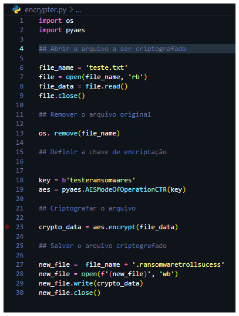
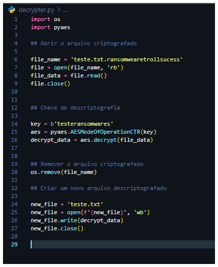
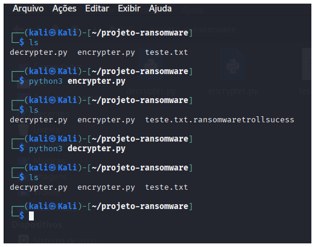

# Projeto Educacional de Ransomware - Fins Didáticos

## Objetivo
Demonstrar técnicas de criptografia para fins de estudo em segurança cibernética.

## ⚠️ Aviso Importante
Este projeto não deve ser usado para atividades maliciosas.

## Funcionalidades

### 1. Criptografia AES-256

*Figura 1: Tela de execução do script de criptografia*

### 2. Descriptografia controlada

*Figura 2: Processo de descriptografia dos arquivos*

## Demonstração do Fluxo Completo

*Figura 3: Sequência completa de criptografia e descriptografia no terminal*

## Como Usar para Aprendizado
1. Execute em ambiente controlado
2. Estude os mecanismos de criptografia
3. Analise as vulnerabilidades